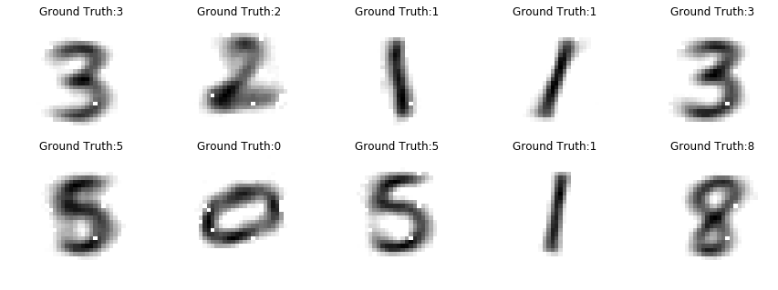
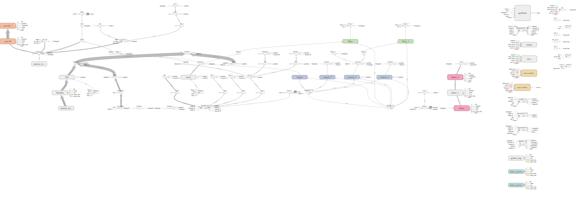

# Capsule Networks
Capsule Networks are networks that are considered to perform "inverse graphics". This means that using the image in the view they give us the embeddings which can be used to reconstruct the image perfectly well. 

In this repository, I created a capsule network inspired by [this paper](https://arxiv.org/pdf/1710.09829.pdf). The network is built entirely with tensorflow's estimator API.

## Architecture
The architecture of the network is as shown below.

## Reconstruction Results

## Graph As Shown on TensorBoard

## Dependencies
1. TensorFlow
2. Matplotlib
3. Numpy